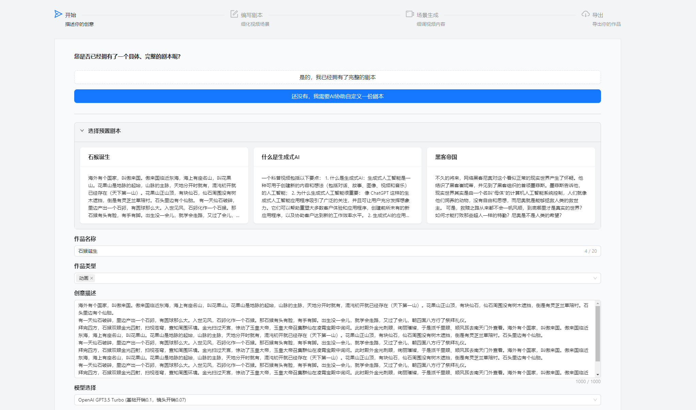
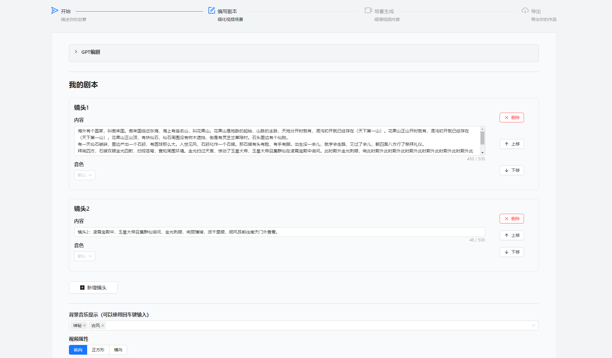
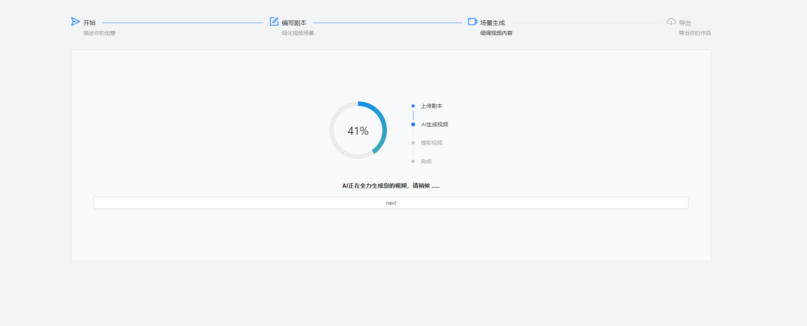
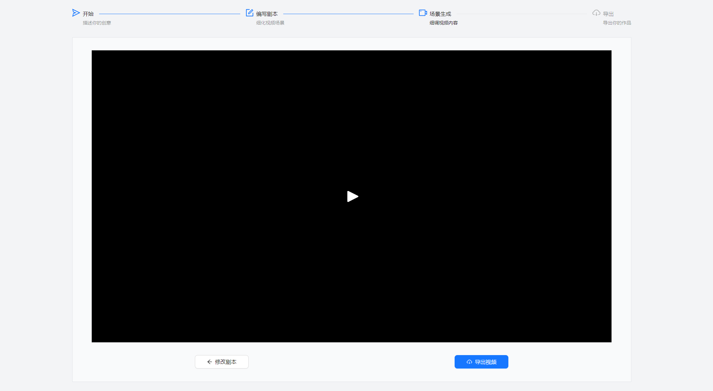
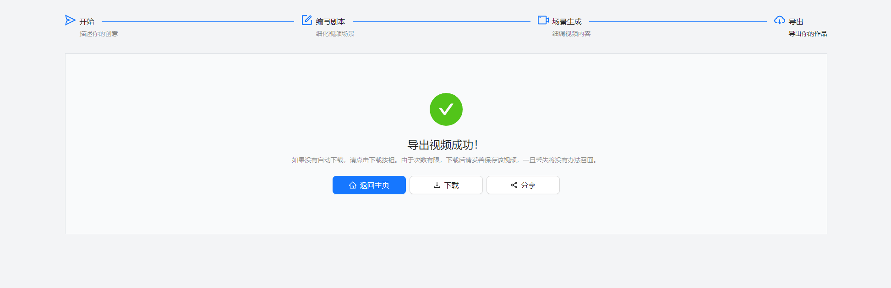

  
  

<h1>
    <b>IAmDirector - 每个人都能成为导演</b>
</h1>
  

  
&nbsp;

在线网站: <https://iamdirector.cn>

Website: <https://iamdirector.cn>

[//]: # (English | [简体中文]&#40;README_zh-CN.md&#41;)

## 介绍 - Introduction

这是一个免费试用AI视频创作平台，集成了基于GPT的视频剧本生成和视频生成功能。
我们的理想是让每个人都能成为导演，以最快的方式将日常中的任何创意转化为高质量的视频，
无论是电影、营销视频、还是自媒体视频。
完整平台请在[这里](https://iamdirector.cn)试用。

由于生成式AI发展迅速，Sora等模型也迅速步入人们关注。
而目前基于生成式模型的前端平台普遍较少，页面功能较为简陋，难以满足用户需求。
因此本项目开源基于[NextJS](https://github.com/vercel/next.js)的前端，
希望能够提供一个用于生成式AI的文字转视频，
尤其是电影从编剧到视频生成的Web前端平台参考。

Everyone can become a director.
The front-end of an AI driven platform for automatic movie/video generation
(form GPT script generation to text2video movie generation).

## 功能 - Features

- [x] 视频剧本生成 - GPT for script generation
    - [x] OpenAI
    - [x] 百度千帆大模型
    - [x] 智谱ChatGLM
- [x] 剧本转视频 - Text2Video
    - [x] [fliki](https://fliki.ai/?via=iamdirector)(API is temporarily unavailable)
    - [ ] [StableDiffusionAPI](https://stablediffusionapi.com/)(expensive and uncertain performance)

## ！文生视频接口暂时无法对接！ - Text2Video API is temporarily unavailable

由于[fliki](https://fliki.ai/?via=iamdirector)近期关闭了API接口，本平台的视频生成功能暂时无法使用。
另一种替代方案是使用[StableDiffusionAPI](https://stablediffusionapi.com/)，
但是由于其高昂的价格成本(147刀/月)和不确定的生成效果，本平台暂时无法实现对接。

但这些并不影响本项目的前端开源和价值，我们仍然希望能够为生成式AI文生视频的前端开发提供一些参考。

## 展示 - Demo

完整平台请在[这里](https://iamdirector.cn)试用。

Please try the full platform [here](https://iamdirector.cn).

### 开始

  

### GPT生成剧本

  

### 生成作品

  

### 作品展示

  

### 导出作品

  

## 版权 - License

#### 本项目的前端代码基于[MIT协议](LICENSE)开源，后端代码暂不开源。

- 本平台的剧本生成和部分AI技术基于[智增增](https://github.com/xing61/xiaoyi-robot),[OpenAI](https://openai.com/)
  和其他主流大语言模型平台。
- 视频生成和部分AI技术基于[fliki](https://fliki.ai/?via=iamdirector)。
- 网站框架基于[NextJS](https://github.com/vercel/next.js)，
  设计参考了[notus-nextjs](https://github.com/creativetimofficial/notus-nextjs)和[nextjs-template](https://github.com/jsulpis/nextjs-template)
- 视频生成后的视频剪辑功能基于[fabric-video-editor](https://github.com/AmitDigga/fabric-video-editor)

This project is released under the [MIT License](LICENSE).

- The script generation and some AI techniques are based on
  [OpenAI](https://openai.com/), [智增增](https://github.com/xing61/xiaoyi-robot)
  and other mainstream LLM platforms
- The video generation and some AI techniques are based on
  [fliki](https://fliki.ai/?via=iamdirector)
- The website is based on [NextJS](https://github.com/vercel/next.js),
  and is designed referencing the [notus-nextjs](https://github.com/creativetimofficial/notus-nextjs) and [nextjs-template](https://github.com/jsulpis/nextjs-template)
- The video trimming function after video generation is based on
  the [fabric-video-editor](https://github.com/AmitDigga/fabric-video-editor)

